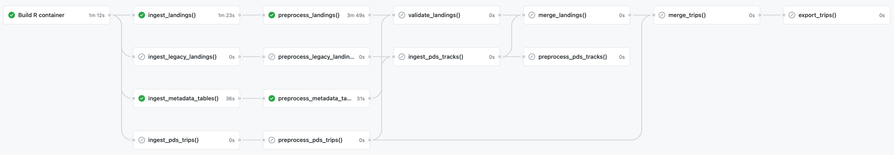

<!-- README.md is generated from README.Rmd. Please edit that file -->

```{r, include = FALSE}
knitr::opts_chunk$set(
  collapse = TRUE,
  comment = "#>",
  fig.path = "man/figures/README-",
  out.width = "100%"
)
```

# peskas.timor.data.pipeline

<!-- badges: start -->
[](https://www.tidyverse.org/lifecycle/#experimental)
[](https://CRAN.R-project.org/package=peskas.timor.data.pipeline)
[](https://codecov.io/gh/WorldFishCenter/peskas.timor.data.pipeline?branch=master)
[](https://github.com/WorldFishCenter/peskas.timor.data.pipeline/actions)
<!-- badges: end -->

The goal of peskas.timor.data.pipeline is to implement, deploy, and execute the data and modelling pipelines that underpin Peskas-East Timor, the small-scale fisheries analytics in East Timor. 

## The pipeline is an R package

peskas.timor.data.pipeline is structured as an R package because it makes it easier to write production-grade software. Specifically, structuring the code as an R package allows us to:

- better handle system and package dependencies,
- forces us to split the code into functions,
- makes it easier to document the code, and 
- makes it easier to test the code 

We make heavy use of [tidyverse style conventions](https://engineering-shiny.org) and the [usethis](https://usethis.r-lib.org) package to automate tasks during project setup and deployment.

For more information about the rationale of structuring the pipeline as a package check [Chapter 3](https://engineering-shiny.org/structuring-project.html#structuring-your-app_) in [*Engineering Production-Grade Shiny Apps*](https://engineering-shiny.org). The book is focused on Shiny applications but the rationale also applies to data pipelines and production-ready code in general. The best place to learn more about package development is probably the [*R packages*](https://r-pkgs.org) book by Hadley Wickham and Jenny Brian.

## The pipeline runs on Github Actions

While each step in the pipeline are defined as a function in the package, these functions are deployed and integrated using [GitHub Actions](https://docs.github.com/en/actions/learn-github-actions). 
This allow us to take advantages of best practices in continous development and integration (CD/CI) and automatically link the code to execution.
However, these workflow functions work almost as scripts because they don't take parameters and are used for their side effects. 

Each job in the pipeline is defined in the workflow file:  [`.github/workflows/data-pipeline.yaml`](https://github.com/WorldFishCenter/peskas.timor.data.pipeline/blob/main/.github/workflows/data-pipeline.yaml) and can be seen in the figure below. Note that additional workflows exist to test the package in multiple environments and build the documentation website. 



The figure above illustrate the jobs that are part of the pipeline workflow. Note that not all of them are implemented yet. 

Generally, artifacts produced by each job are stored in a cloud storage container and retrieved from the cloud storage by the next job in the pipeline. 
When storing a job's artifacts are versioned using the function `add_version()`, which generally includes a timestamp and the commit sha. This approach allow us to trace each artifact to a unique run of the pipeline. 
When retrieving jobs can call `cloud_object_name()` to obtain the latest or an specific version of an artifact. 

## Environment parameters are specified in the config file

The parameters that determine how the pipeline is run are specified in [`inst/conf.yml`](https://github.com/WorldFishCenter/peskas.timor.data.pipeline/blob/main/inst/conf.yml). 
This file can be accessed using `system.file("conf.yml",package="peskas.timor.data.pipeline")`.
Using this file, as opposed to, for example, including them in the code, allows us to easily switch parameters depending on the environment. 
We use the [config](https://github.com/rstudio/config) package to read the configuration file.
We use three different environments (see below). 
To determine which environment to use, the config package checks the environment variable `R_CONFIG_ACTIVE`.

- Remote development environment (default):
The development environment is the "default" configuration. 
This environment should be used when the code is running in the cloud 
One characteristic of this environment is that it uses cloud storage buckets that differ to those that the real application uses.
This makes it ideal to test the code and the pipeline before it's deployed into production. 
Because this environment is designed to run in the cloud, it indicates that API tokens and authentication files should be read from environment variables.
This works well when the code runs in GitHub Actions, because the workflow has instructions to read authentication details from [GitHub secrets](https://docs.github.com/en/actions/reference/encrypted-secrets) and passes it to R as environment variables. 

- Local development environment:
The "local" environment is similar to the default environment in that is used for development and therefore uses resources ideal for testing the code. 
The main difference is that the authentication information is not read from environment variables but from local files. 
Specifically authentication files should live in a directory called `auth` which should never be committed to git. 
It is possible to run `Sys.setenv(R_CONFIG_ACTIVE="local")` in the R console to ensure the local environment is activated the next time `conf.yml` is read.
An even easier alternative is to add the key-value pair `R_CONFIG_ACTIVE=local` to the `.Renviron` file in the project directory. 

- Production environment: 
The production environment is similar to the default environment in that it's designed to run in the cloud and read authentication details from the cloud. 
It differs in that it uses cloud resources that should be used exclusively in production once things have been tested out. 
This environment is active when `R_CONFIG_ACTIVE=production`; this environment variable is passed by pipeline workflow file when the code executes from the "main" git branch.

## We use docker containers 

We use docker containers to make it easier to run and develop code. 

- Development: We use the main [`Dockerfile`](https://github.com/WorldFishCenter/peskas.timor.data.pipeline/blob/main/Dockerfile) for development. It's based on the rocker/geospatial image and spins up an RStudio server instance with quite a large number of packages. To start an instance of this container you can simply go to the project's directory and run `docker-compose up -d --build` from the terminal console.

- Production: We use [`Dockerfile.prod`](https://github.com/WorldFishCenter/peskas.timor.data.pipeline/blob/main/Dockerfile.prod) to run the code in production. 
This image is based in a more lightweight version of R and only installs the required packages. 
The first job in the pipeline builds this container and other steps use it to run the code. 
This allow us to run the code under the same environment regardless of the cloud computing infrastructure that runs it. 

## Logging

We use the [logger](https://daroczig.github.io/logger/) package to log events in production. 
