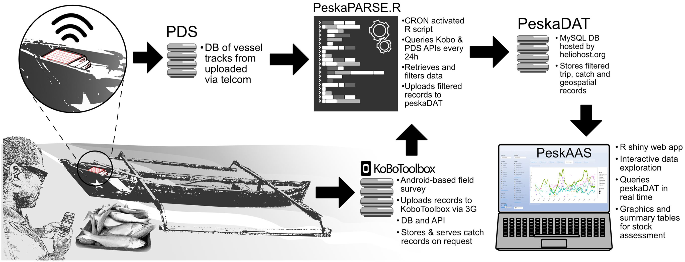

```{r setup, include=FALSE}
knitr::opts_chunk$set(cache=TRUE)
```

```{r, include=FALSE}
#libraries
library(ggplot2)
library(magrittr)
#get data
pars <- peskas.timor.data.pipeline::read_config()

# avoid to pay google continuously
if(isTRUE(length(list.files(pattern = c('.rds')))==4)){
aggregated <- readRDS(list.files(pattern = 'timor_aggregated'))
trips <- readRDS(list.files(pattern = 'timor_trips'))
catch <- readRDS(list.files(pattern = 'timor_catch'))
catch_types <- readRDS(list.files(pattern = 'metadata-tables'))$catch_types%>% 
  dplyr::select('Catch code'=interagency_code,
                'Taxonomic rank (family)'=catch_family,
                'Common name'=catch_name_en)
}else{
files <- 
c("aggregated__", "trips", "catch") %>%
  purrr::map(., ~ peskas.timor.data.pipeline::cloud_object_name(
    prefix = paste(pars$export$file_prefix, .x, sep = "_"),
    version = "latest",
    extension = "rds",
    provider = pars$public_storage$google$key,
    options = pars$public_storage$google$options
  )) %>%
  do.call("rbind", .) %>%
  as.character() %>%
  unique() %>%
  purrr::walk(.,
    peskas.timor.data.pipeline::download_cloud_file,
    provider = pars$public_storage$google$key,
    options = pars$public_storage$google$options
  )
aggregated <- readRDS(list.files(pattern = 'timor_aggregated'))
trips <- readRDS(list.files(pattern = 'timor_trips'))
catch <- readRDS(list.files(pattern = 'timor_catch'))
catch_types <- peskas.timor.data.pipeline::get_catch_types(pars) %>% 
  dplyr::select('Catch code'=interagency_code,
                'Taxonomic rank (family)'=catch_family,
                'Common name'=catch_name_en)
}

#palettes
year_palette <- rev(c("#bda639","#1b5767","#629a9b","#c51f5d","#92684d"))
catch_use_palette <- rev(c("#9f8985","#87bdbc","#dbdbc9"))

# help functions 
label_date <- function(x){
  format(x, "%b") %>%
    stringr::str_replace("Jan", paste0("Jan\n", format(x, "%Y")))
}

# useful data
temp_range <- paste(zoo::as.yearmon(min(aggregated$month$date_bin_start,na.rm=TRUE)),
                    zoo::as.yearmon(max(aggregated$month$date_bin_start,na.rm=TRUE)),
                    sep = " - ")
```

***

# Aim
This report summarises relevant statistics and insights from the Peskas platform during the period `r temp_range`. The report examines the main temporal trends in the national revenue related to small-scale fishing in Timor-Leste and provides quantitative and qualitative information on the catches.

# What is Peskas
Peskas is the official fisheries national monitoring system of Timor-Leste and represents one of the most sophisticated data collection systems for small-scale fisheries in the world. 

Peskas' platform collects real-time information directly from fishermen's activity via a system of digital surveys developed in [$\color{myblue}{\text{KoBo toolbox}}$](http://www.kobotoolbox.org/). In addition, Peskas uses the technology provided by [$\color{myblue}{\text{Pelagic Data System}}$](https://www.pelagicdata.com/) to record vessel movements via solar-powered tracking devices (see Figure \@ref(fig:flowchart)). 

The data and the information collected is subjected to an elaborate processing and cleaning through an open-source code pipeline on [$\color{myblue}{\text{GitHub}}$](https://github.com/WorldFishCenter/peskas.timor.data.pipeline), and provide important data in the hands of fisheries officers, researchers and local stakeholders and enables them to better understand the contribution of fish and fisheries to local livelihoods and food security.

Information about the process and user-centred design of the Peskas pipeline and initial analytics, and its application in fisheries research & management can be found in the following publications:

* [$\color{myblue}{\text{PeskAAS: A near real-time monitoring system for small-scale fisheries in Timor-Leste}}$](https://www.fao.org/documents/card/en/c/cb2030en). In A. Tilley & M. B. Roscher (Eds.), Information and communication technologies for small-scale fisheries (ICT4SSF) - A handbook for fisheries stakeholders. In support of the implementation of the Voluntary Guidelines for Securing Sustainable Small-Scale Fisheries in the Context of Food Security and Poverty Eradication (pp. 11–18). FAO; WorldFish.
* [$\color{myblue}{\text{PeskAAS: A near-real-time, open-source monitoring and analytics system for small-scale fisheries}}$](https://journals.plos.org/plosone/article?id=10.1371/journal.pone.0234760). PloS One, 15(11), e0234760.
* [$\color{myblue}{\text{Nearshore Fish Aggregating Devices Show Positive Outcomes for Sustainable Fisheries Development in Timor-Leste}}$](https://www.frontiersin.org/articles/10.3389/fmars.2019.00487/full). Frontiers in Marine Science, 6, 487.
\newline 
\newline 

(ref:flowchart) A diagrammatic representation of the Peskas application. From [$\color{myblue}{\text{PeskAAS: A near-real-time, open-source monitoring and analytics system for small-scale fisheries}}$](https://journals.plos.org/plosone/article?id=10.1371/journal.pone.0234760)

```{r flowchart, echo=FALSE, message=FALSE, fig.height=4, fig.width=8,fig.cap='(ref:flowchart)'}

```
\pagebreak

# Revenue
The landing value in USD is obtained from landing surveys at multiple sites around the country. Fishers are asked for the estimated price of their catch at the landing site regardless of whether the catch is deemed for sale or consumption. Prices may change throughout the year and across landing sites. We then obtain monthly estimates using a random-effect statistical model.
\newline 
\newline 

```{r, echo=FALSE, warning=FALSE, message=FALSE, fig.height=4, fig.width=8, fig.cap='Time series of monthly aggregated total revenue. The red line is the local polynomial regression fitted to the time series while the shaded area represents the 0.95 confidence interval.'}
max_rev <- max(aggregated$month$revenue,na.rm=TRUE)
min_rev <- min(aggregated$month$revenue,na.rm=TRUE)

aggregated$month %>% 
  dplyr::mutate(month=lubridate::month(date_bin_start,label=TRUE),
                year=lubridate::year(date_bin_start)) %>% 
  dplyr::filter(!is.na(date_bin_start)&year!=2017) %>% 
  dplyr::select(year, month, date_bin_start, revenue) %>%
  ggplot(aes(x=date_bin_start,y=revenue))+
  geom_line(color="#447597")+
  geom_point(color="#447597")+
  stat_smooth(method = "loess",color="#976644",alpha=0.1)+
  labs(x="month",y="total revenue (USD)",
       title = "Interannual distribution of monthly total revenue")+
  scale_x_date(date_breaks = "3 month", minor_breaks = NULL, labels = label_date)+
  coord_cartesian(ylim=c(96035.99,max_rev))+
  theme_minimal(14)+
  theme(text = element_text(family="Helvetica"))
```


```{r, echo=FALSE, warning=FALSE, fig.cap="Monthly revenue shown for each year of Peskas' activity", fig.height=4, fig.width=8,out.height="80%",out.width="80%"}
aggregated$month %>% 
    dplyr::mutate(month=lubridate::month(date_bin_start,label=TRUE),
                year=lubridate::year(date_bin_start)) %>% 
  dplyr::filter(!is.na(date_bin_start)&year!=2017) %>% 
  dplyr::select(year, month, date_bin_start, revenue) %>%
  ggplot()+
  geom_line(mapping=aes(x=as.factor(month),y=revenue,color=as.factor(year),group=as.factor(year)))+
  geom_point(mapping=aes(x=as.factor(month),y=revenue,color=as.factor(year)))+
  labs(x="",y="total revenue (USD)",color="year",
       title = "Seasonal distribution of monthly total revenue")+
  scale_color_manual(values=year_palette)+
  coord_polar()+
  theme_minimal(10)+
  theme(text = element_text(family="Helvetica"))+
  theme(axis.ticks.y = element_line(colour = "black"))
```

\pagebreak

# Catches 
Brief explanation of how identification works, must contain the table of catch codes table
\newline 


```{r, echo=FALSE, warning=FALSE}
catch_types %>% 
  replace(is.na(.), "-") %>% 
  knitr::kable("pipe",width=4,
               caption = "Catch codes ([ASFIS](https://www.fao.org/fishery/collection/asfis/en)), scientific and common names of Peskas catches")
```


```{r, echo=FALSE, warning=FALSE, fig.cap="Total proportion of catches final usage (top) and usage proportion of each catch ranked by total number of catches (bottom)", fig.height=7, fig.width=6,out.height="100%",out.width="100%"}
rank_catch <-
  catch %>%
  dplyr::filter(individuals != 0) %>%
  dplyr::count(catch_taxon, catch_purpose) %>%
  ggplot() +
  geom_col(mapping = aes(x = reorder(catch_taxon, n), y = n, fill = catch_purpose)) +
  theme_minimal(10) +
  theme(text = element_text(family = "Helvetica")) +
  theme(legend.position = "") +
  scale_fill_manual(values = catch_use_palette) +
  labs(y = "number of catches", x = "", fill = "") +
  coord_flip()

tot_catch <-
  catch %>%
  dplyr::filter(individuals != 0) %>%
  dplyr::count(catch_purpose) %>%
  dplyr::mutate(
    dummy_var = rep("dummycol", nrow(.)),
    total_catches = sum(n),
    proportion = n / total_catches * 100
  ) %>%
  ggplot(aes(x = dummy_var, y = n, fill = catch_purpose)) +
  geom_col(width = 5) +
    geom_text(aes(label=paste0(round(proportion,1),"%")),
            position=position_stack(vjust=0.5),
            color="white",
            fontface="bold")+
  theme_minimal(10) +
  theme(
    legend.position = "top",
    panel.border = element_blank(),
    panel.grid.major = element_blank(),
    panel.grid.minor = element_blank(),
    axis.text.y = element_blank(),
    axis.text.x = element_blank(),
    axis.ticks.y = element_blank(),
    axis.ticks.x = element_blank()
  ) +
  scale_fill_manual(values = catch_use_palette) +
  labs(y = "", x = "", fill = "catch purpose") +
  coord_flip()

cowplot::plot_grid(tot_catch,
  rank_catch,
  ncol = 1,
  rel_heights = c(1.25, 7),
  align = "v"
)
```
\newline 
\newline 


```{r, echo=FALSE, warning=FALSE,message=FALSE,fig.cap="Interannual proportion catches final usage", fig.height=4, fig.width=8}
dplyr::left_join(catch,trips,by="trip_id") %>%
  dplyr::filter(individuals != 0) %>%
  dplyr::mutate(landing_date_month=lubridate::floor_date(landing_date,unit = "month")) %>%
  dplyr::group_by(landing_date_month) %>%
  dplyr::count(catch_purpose) %>%
  dplyr::mutate(tot=sum(n,na.rm=TRUE),
                usage_proportion=n/tot*100) %>%
  ggplot(aes(landing_date_month,usage_proportion,group=catch_purpose,color=catch_purpose))+
  geom_line()+
  geom_point()+
  labs(x="month",y="Usage proportion",
       color="usage proportion",
       title = "Time series of catches final usage")+
  scale_x_date(date_breaks = "3 month", minor_breaks = NULL, labels = label_date)+
  scale_y_continuous(labels = scales::percent_format(scale = 1))+
  scale_color_manual(values = catch_use_palette) +
  theme_minimal(14)+
  theme(text = element_text(family="Helvetica"),
        legend.position = "top",
        legend.title=element_blank())
```
\newline 
\newline 


```{r, echo=FALSE, warning=FALSE, fig.cap="Main catches descriptors. Distribution of the number of individuals (A), their length (B)  and weigth (C) considering all the catches.", fig.height=4, fig.width=9,out.height="100%",out.width="100%"}
individuals_p <-
catch %>% 
  dplyr::filter(individuals!=0) %>% 
  ggplot()+
  geom_density(mapping=aes(x=individuals),adjust=2,color="#447597",fill="#447597")+
  theme_minimal(14)+
  theme(text = element_text(family="Helvetica"))+
  labs(x="Number of individuals",y="kernel density")

length_p <- 
catch %>% 
  dplyr::filter(individuals!=0) %>% 
  ggplot()+
  geom_density(mapping=aes(x=length),adjust=2,color="#447597",fill="#447597")+
  theme_minimal(14)+
  theme(text = element_text(family="Helvetica"))+
  labs(x="Total length (cm)",y="")

weigth_p <-
catch %>% 
  dplyr::filter(individuals!=0) %>% 
  ggplot()+
  geom_density(mapping=aes(x=weight/1000),adjust=2,color="#447597",fill="#447597")+
  theme_minimal(14)+
  theme(text = element_text(family="Helvetica"))+
  labs(x="Total weight (kg)",y="")

cowplot::plot_grid(individuals_p,
                   length_p,
                   weigth_p,
                   ncol=3,align="hv",labels="AUTO")
```
\newline 
\newline 


```{r, echo=FALSE, warning=FALSE, fig.cap="Catches ranked by average value (USD). The darkest shade in each bar represent the 95 confidence interval for average, other shades indicate the 5th and the 25th, and the 75th and 95th going from left to right respectively.", fig.height=7, fig.width=6,out.height="100%",out.width="100%"}

  dplyr::left_join(catch, trips, by = "trip_id") %>%
    dplyr::filter(individuals > 0 &
      nchar(landing_taxa) == 3 &
      landing_value != 0) %>%
    dplyr::mutate(norm_value = landing_value / (weight / 1000)) %>%
    dplyr::select(catch_taxon, norm_value) %>%
    dplyr::group_by(catch_taxon) %>%
    dplyr::summarise(
      mean = mean(norm_value, na.rm = TRUE),
      n = dplyr::n(),
      sd = sd(norm_value, na.rm = TRUE),
      q95 = quantile(norm_value, 0.95, na.rm = TRUE),
      q75 = quantile(norm_value, 3 / 4, na.rm = TRUE),
      q25 = quantile(norm_value, 1 / 4, na.rm = TRUE),
      q5 = quantile(norm_value, 0.05, na.rm = TRUE)
    ) %>%
    dplyr::mutate(
      se = sd / sqrt(n),
      left95 = mean - 2 * se,
      right95 = mean + 2 * se,
      left95 = dplyr::case_when(
        left95 < 0 ~ 0,
        TRUE ~ left95
      )
    ) %>%
    ggplot(aes(x = reorder(catch_taxon, mean), y = mean)) +
    geom_crossbar(aes(ymin = q5, ymax = q95), fill = "#c6d5df", color = "#c6d5df", width = 0.3) +
    geom_crossbar(aes(ymin = q25, ymax = q75), fill = "#8eacc0", color = "#8eacc0", width = 0.3) +
    geom_crossbar(aes(ymin = left95, ymax = right95), fill = "#28465a", color = "#28465a", width = 0.3) +
    geom_point(fill = "#28465a", color = "#28465a", size = 2.5) +
    coord_flip(ylim = c(0, 1000)) +
    theme_minimal(10)+
    labs(x="",y="Value (USD) per Kilogram",subtitle ="Most valuable catch types")+
    theme(text = element_text(family="Helvetica"))
```

