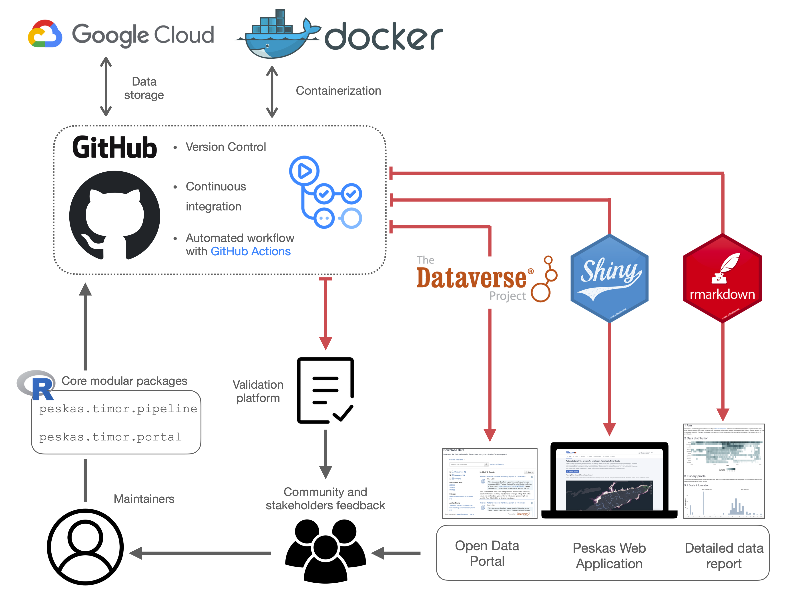

```{r setup, include = FALSE}
knitr::opts_chunk$set(echo = TRUE, echo = FALSE)
```

### Introductory information

Peskas is a [web portal](https://timor.peskas.org/) displaying data and insights on the fisheries of Timor-Leste. It is the official fisheries national monitoring system of Timor-Leste. Peskas relies on a team of Timorese enumerators collecting catch data from fishers around Timor-Leste. Catch data are matched with vessel tracking data to show fishing trends over time and space.

Peskas is the result of an ongoing partnership between WorldFish and the Timor-Leste Ministry of Agriculture and
Fisheries' Department of Fisheries, Aquaculture and Marine Resources since 2016, was built with the objectives of being low cost, open source, open access and near-real time.

Peskas was made possible with the generous donations of The Royal Norwegian Embassy in Jakarta, The Minderoo Foundation, The CGIAR Big Data Platform and the Schmidt Foundation.

Peskas is funded by the Government of Timor-Leste since 2021 with technical support from WorldFish and Pelagic Data Systems Inc.

Information about the process and user-centered design of the Peskas pipeline and initial analytics, and its application in fisheries research & management can be found in the following publications:

- [PeskAAS: A near real-time monitoring system for small-scale fisheries in Timor-Leste](http://www.fao.org/documents/card/en/c/cb2030en). In A. Tilley & M. B. Roscher (Eds.), Information and communication technologies for small-scale fisheries (ICT4SSF) - A handbook for fisheries stakeholders. In support of the implementation of the Voluntary Guidelines for Securing Sustainable Small-Scale Fisheries in the Context of Food Security and Poverty Eradication (pp. 11–18). FAO; WorldFish.
- [PeskAAS: A near-real-time, open-source monitoring and analytics system for small-scale fisheries](https://journals.plos.org/plosone/article?id=10.1371/journal.pone.0234760). PloS One, 15(11), e0234760.
- [Nearshore Fish Aggregating Devices Show Positive Outcomes for Sustainable Fisheries Development in Timor-Leste](https://www.frontiersin.org/articles/10.3389/fmars.2019.00487/full). Frontiers in Marine Science, 6, 487."

### The data

This repository contains trips and catch data in *tsv* files format related to the Peskas project during the period **`r data_description$time_range`**. Files prefixed with **trips** and **catch** provide information on the fishing trips and catches properties respectively. The file prefixed with **aggregated** provides the monthly estimates of the most important outcomes of Timor small-scale fishery.


### Methodological information

The whole Peskas process returns a significant amount of information of different types, from the people involved in the project, the properties of the boats, the species caught, the temporal and spatial information related to fishing trips. This heterogeneous complex of information needs to be tracked, organized and cleaned to be understandable and usable by the community. For this purpose, the path from raw to final data combines the use of many software tools to guarantee that the Peskas data workflow is processed according to the principles of traceability, reproducibility and transparency of the data. 

Peskas was designed to be expanded and eventually distributed in different contexts. One of the biggest issues associated with the distribution of software products is represented by the compatibility between different platforms and different operating systems, as a product developed under a certain platform and version’ dependencies may not work in other platforms. Peskas' workflow uses containerization technology to face this problem, and specifically Docker, which provides an isolated environment containing all the libraries, dependencies and configurations necessary for the correct functioning of the application.

The [source code](https://github.com/WorldFishCenter/peskas.timor.data.pipeline) regulating the several steps of data workflow is maintained in an R package that bundles together the code, the documentation, the tests, increasing the general manageability and shareability of the whole platform. Furthermore, the code was conceived and developed in a modular and functional-oriented way.

Given the complexity of the data that compose Peskas, any change to the code must be regularly tested and tracked, a practice called version control. Peskas’ data pipeline relies on the GitHub version control service which guarantees an active and reversible register of the changes made to Peskas as well as improves and speeds up the integration process of new features. All the data pipeline' steps are organized and triggered according to a specific plan through Github Actions, a service provided by GitHub which automates the data workflow and facilitates the identification of any errors during the progress of the pipeline.

The final steps of the pipeline produce data products that will be processed by other tools for distribution. Currently, the final products constitute a dashboard web application developed with Shiny, a data report generated with Rmarkdown, and the actual data, distributed through the open-source Dataverse portal.

The figure below gives a schematic overview of the Peskas’ data infrastructure.
  
  
  
```{r , echo=FALSE, warning=FALSE, include = TRUE, out.width="80%"}

```


#### Workflow steps

The following workflow runs on a daily scale through GitHub actions, automatically updating all the input data and the respective outputs.

1. **Build Docker container**

The first step consists in building the virtual space in which the data pipeline application runs (the container). All subsequent steps operate in this container, which can be run on any host platform.

2. **Raw data acquisition**

In this phase, the raw data associated with the survey landings and the spatial and temporal information of the fishing trips are retrieved through the services provided by the KoBo toolbox and Pelagic data system (PDS) respectively. These data are accessed through the APIs of the respective services and are uploaded and stored on Google Cloud. Data from the SSF project and more recent Peskas data are uploaded separately as they are characterised by a different structure. Each file is assigned with an ID to make each uploaded object unique and easy to recall.

3. **Data preprocessing**

The latest versions of survey landings' and PDS raw data are downloaded from Google Cloud and elaborated to return an appropriate format for subsequent processing. Specifically, the structure of the raw data tables is reorganized and compacted, date formats are homogenized, and data tables are converted into a binary format that is easier to deal with in R. SSF-project raw data are subjected to a more intensive preprocessing as information including the species' codes, habitats' types and gear' types are defined under a different syntax from that of recent Peskas data.

4. **Landings merging and weight calculation**

This phase involves merging the SSF and recent Peskas data into a single preprocessed dataframe. From this dataframe, we estimate the weight associated with each fishing trip by referring to the length-weight tables provided by the FishBase database. Specifically, we use the API service offered by FishBase to associate both the length-length and length-weight conversion tables with the species captured in Peskas and return an accurate measurement of the catchweight. Since not all species were covered by the FishBase databases, we manually extracted some conversion tables from the SeaLifeBase database.

5. **Data validation**

The data collected by Peskas are not always accurate and may contain many types of errors such as temporal inconsistencies, typo errors, altered numerical values. In this step, the preprocessed data are checked, cleaned and validated. We use the absolute deviation around the median (MAD) for the identification of outliers in the distribution of the numerical values as the number of individuals, catch values and weight. Moreover, the variables are renamed according to a specific ontology developed for small-scale fisheries. 

6. **Data modelling**

In this phase the validated data estimate summary statistics of landing value, catches and landings per unit by modelling validated data using a random-effect statistical model (glmmTMB)

7. **Data export**

This step involves the preparation and the distribution of data across different platforms (see scheme above). The data are firstly anonymised to guarantee the privacy of fishermen involved in Peskas, then we estimate daily, monthly and yearly summaries of Peskas main descriptors. These data constitute the primary material on which the 3 main outputs are generated:

- The daily, monthly and yearly data of Peska’s summaries, uploaded via an API service on the open-source data portal Dataverse every 6 months. 

- The Peskas web [interactive dashboard](https://timor.peskas.org/)

- A pdf data report, generated with Rmarkdown and openly downloadable from web interactive dashboard


### Data specific information


#### Trips dataframe 


```{r , echo=FALSE, include = TRUE}
knitr::kable(data_description$trips_tab)
```


#### Catch dataframe


```{r , echo=FALSE, include = TRUE}
knitr::kable(data_description$catch_tab)
```

#### Monthly aggregated dataframe

```{r , echo=FALSE, include = TRUE}
knitr::kable(data_description$aggr_tab)
```
