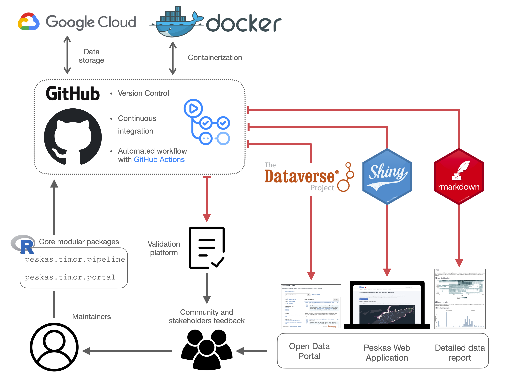

```{r setup, include = FALSE}
knitr::opts_chunk$set(echo = TRUE, echo = FALSE)
```

### Introductory information

Peskas is a [web portal](https://timor.peskas.org/) displaying data and insights on the fisheries of Timor-Leste.
It is the official national fisheries monitoring system of Timor-Leste, leveraging a team of Timorese enumerators to collect catch data from fishers around Timor-Leste.
This data is complemented by vessel tracking data to illustrate fishing trends over time and space.

Peskas is the result of an ongoing partnership between WorldFish and the Timor-Leste Ministry of Agriculture and Fisheries' Department of Fisheries, Aquaculture, and Marine Resources since 2016.
It was designed to be low cost, open source, open access, and near-real time.

The development of Peskas was supported by The Royal Norwegian Embassy in Jakarta, The Minderoo Foundation, The CGIAR Big Data Platform, and the Schmidt Foundation.
Since 2021, it has been funded by the Government of Timor-Leste with technical support from WorldFish and Pelagic Data Systems Inc.

Peskas combines open-source software and automated workflows to facilitate sustainable fisheries management and decision-making.
Its functionalities are detailed in several publications:

-   [PeskAAS: A near real-time monitoring system for small-scale fisheries in Timor-Leste](http://www.fao.org/documents/card/en/c/cb2030en). In A. Tilley & M. B. Roscher (Eds.), Information and communication technologies for small-scale fisheries (ICT4SSF) - A handbook for fisheries stakeholders. In support of the implementation of the Voluntary Guidelines for Securing Sustainable Small-Scale Fisheries in the Context of Food Security and Poverty Eradication (pp. 11–18). FAO; WorldFish.
-   [PeskAAS: A near-real-time, open-source monitoring and analytics system for small-scale fisheries](https://journals.plos.org/plosone/article?id=10.1371/journal.pone.0234760). PloS One, 15(11), e0234760.
-   [Nearshore Fish Aggregating Devices Show Positive Outcomes for Sustainable Fisheries Development in Timor-Leste](https://www.frontiersin.org/articles/10.3389/fmars.2019.00487/full). Frontiers in Marine Science, 6, 487."

### The data

This repository contains trips and catch data in *tsv* files format related to the Peskas project during the period **`r data_description$time_range`**.
Files prefixed with **trips** and **catch** provide information on the fishing trips and catches properties respectively.
The file prefixed with **aggregated** provides the monthly estimates of the most important outcomes of Timor small-scale fishery.

### Methodological information

Peskas processes a wide array of information, from the people involved to the properties of the boats, species caught, and spatial and temporal data related to fishing trips.
This data is tracked, organized, and cleaned to be understandable and usable by the community.
The workflow combines various software tools to ensure traceability, reproducibility, and transparency.

Peskas' workflow uses Docker containerization technology to ensure compatibility across different platforms.
The [source code](https://github.com/WorldFishCenter/peskas.timor.data.pipeline) for the data workflow is maintained in an R package, promoting modularity, manageability, and shareability.

The workflow is regularly tested and tracked using GitHub version control and automated with GitHub Actions, facilitating daily updates and error detection.
The final data products include a Shiny-based web application, an Rmarkdown-generated data report, and datasets distributed via the Dataverse portal.

Below is a schematic overview of the Peskas data infrastructure:

```{r , echo=FALSE, warning=FALSE, include = TRUE, out.width="80%"}

```

#### **Workflow Steps**

The workflow runs daily via GitHub actions, updating all input data and outputs:

1.  **Build Docker Container**

    -   The first step consists in building the virtual space in which the data pipeline application runs (the container).
        All subsequent steps operate in this container, which can be run on any host platform.

2.  **Raw Data Acquisition**

    -   In this phase, the raw data associated with the survey landings and the spatial and temporal information of the fishing trips are retrieved through the services provided by the KoBo toolbox and Pelagic data system (PDS) respectively.
        These data are accessed through the APIs of the respective services and are uploaded and stored on Google Cloud.
        Data from the SSF project and more recent Peskas data are uploaded separately as they are characterized by a different structure.
        Each file is assigned an ID to make each uploaded object unique and easy to recall.

3.  **Data Preprocessing**

    -   The latest versions of survey landings' and PDS raw data are downloaded from Google Cloud and elaborated to return an appropriate format for subsequent processing.
        Specifically, the structure of the raw data tables is reorganized and compacted, date formats are homogenized, and data tables are converted into a binary format that is easier to deal with in R.
        SSF-project raw data are subjected to more intensive preprocessing as information including the species' codes, habitats' types, and gear types are defined under a different syntax from that of recent Peskas data.

4.  **Landings Merging and Weight Calculation**

    -   This phase involves merging the SSF and recent Peskas data into a single preprocessed dataframe.
        From this dataframe, we estimate the weight associated with each fishing trip by referring to the length-weight tables provided by the FishBase database.
        Specifically, we use the API service offered by FishBase to associate both the length-length and length-weight conversion tables with the species captured in Peskas and return an accurate measurement of the catch weight.
        Since not all species were covered by the FishBase databases, we manually extracted some conversion tables from the SeaLifeBase database.

5.  **Data Validation**

    -   The data collected by Peskas are not always accurate and may contain many types of errors such as temporal inconsistencies, typo errors, and altered numerical values.
        In this step, the preprocessed data are checked, cleaned, and validated.
        We use the absolute deviation around the median (MAD) for the identification of outliers in the distribution of numerical values such as the number of individuals, catch values, and weight.
        Moreover, the variables are renamed according to a specific ontology developed for small-scale fisheries.

6.  **Data Modelling**

    -   In this phase, the validated data estimate summary statistics of landing value, catches, and landings per unit by modeling validated data using a random-effect statistical model (glmmTMB).

7.  **Data Export**

    -   This step involves the preparation and the distribution of data across different platforms.
        The data are firstly anonymized to guarantee the privacy of fishermen involved in Peskas, then we estimate daily, monthly, and yearly summaries of Peskas main descriptors.
        These data constitute the primary material on which the three main outputs are generated:

        -   The daily, monthly, and yearly data of Peskas’ summaries, uploaded via an API service on the open-source data portal Dataverse every six months.

        -   The Peskas web [interactive dashboard](https://timor.peskas.org/)

        -   A PDF data report, generated with Rmarkdown and openly downloadable from the web interactive dashboard.

Below is a schematic overview of the Peskas workflow:

```{r , echo=FALSE, warning=FALSE, include = TRUE, out.width="80%"}
knitr::include_graphics("peskas_workflow.png")
```

#### 

### Data specific information

The data repository includes three main dataframes: Trips, Catch, and Monthly Aggregated dataframes.
Variables are aligned with the [Aquatic Food Ontology (AQFO)](https://agroportal.lirmm.fr/ontologies/AQFO) for enhanced clarity and standardization.

#### Trips dataframe

```{r , echo=FALSE, include = TRUE}
knitr::kable(data_description$trips_tab)
```

#### Catch dataframe

```{r , echo=FALSE, include = TRUE}
knitr::kable(data_description$catch_tab)
```

#### Monthly aggregated dataframe

```{r , echo=FALSE, include = TRUE}
knitr::kable(data_description$aggr_tab)
```
